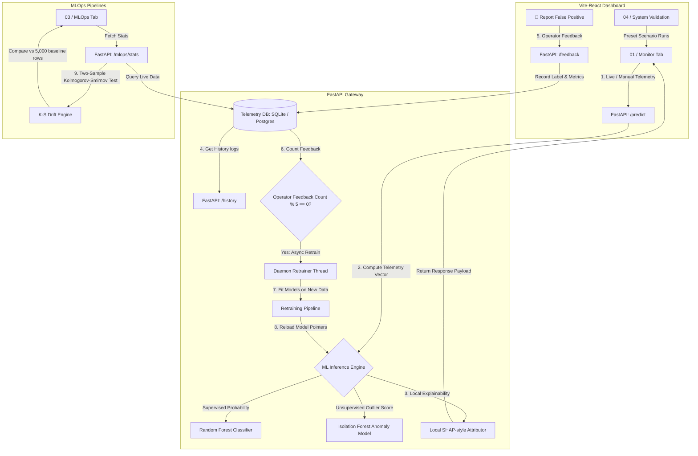

# AXON Predictive Engine - MLOps & System Architecture Playbook

AXON is an enterprise-grade, high-fidelity MLOps and predictive maintenance application designed to monitor distributed system health, explain individual AI risk predictions using additive feature attributions (SHAP-style), detect statistical data drift, and perform closed-loop active learning with zero-downtime model hotswapping.

---

## 🏗️ 1. System Design & Data Flow

AXON is built as a fully decoupled, production-ready system consisting of:
1. **Frontend**: A high-fidelity SPA built with **React (Vite)** and styled with Vanilla CSS (Dark Glassmorphic Theme).
2. **Backend**: A high-performance **FastAPI** gateway orchestrating predictions, database writes, drift analysis, and model retraining.
3. **Storage**: A persistent relational layer supporting **SQLite** (for local sandbox testing) and standard **PostgreSQL** (compatible with Supabase, AWS RDS, or GCP Cloud SQL).

### 🔄 Data & Signal Pipeline Flowchart



---

## 🧠 2. Core Machine Learning Mechanics

AXON integrates a hybrid supervised/unsupervised machine learning pipeline to capture both historical failures and novel zero-day operational anomalies.

### 2.1. Supervised Risk Classification (Random Forest)
A Random Forest Classifier is trained on **8 telemetry features**:
*   **System Workload**: CPU Usage (%), RAM Usage (%), Active Thread Count
*   **Infrastructure Health**: Core Temperature (°C), Network Latency (ms), Net Throughput (Mbps)
*   **Storage Health**: Disk I/O Saturation (%), Swap Space Usage (%)

It outputs the probability of system failure $P(\text{Failure} \mid X)$.

### 2.2. Unsupervised Anomaly Detection (Isolation Forest)
An Isolation Forest model runs parallel to the classifier. Because supervised classifiers can only predict failure modes they have seen in training data, the Isolation Forest acts as an outlier detector to identify **zero-day anomalies**. It returns an anomaly score:
*   An outlier score is returned based on the average path lengths of isolation trees.
*   If the outlier score falls below the threshold (negative values), the UI flags an warning: `⚠️ Unsupervised Anomaly Detected!`.

---

## 📊 3. Explainable AI & Statistical MLOps Mathematics

To prevent the AI from acting as a "black box," AXON implements local prediction explanations and statistical quality assurance drift monitors.

### 3.1. Local Explainability (Additive SHAP-style Contributions)
When a user requests a prediction, the backend calculates how much each of the 8 features drove the prediction away from the baseline failure probability (set at a training mean of $\sim 10\%$).

1. **Calculate Standardized Deviation**:
   AXON measures the feature deviation from the baseline training mean, scaled by standard deviation and global feature importance:
   $$\text{raw\_contribution}_i = \frac{x_i - \mu_i}{\sigma_i} \times \text{Importance}_i$$
   where $x_i$ is the active input, $\mu_i$ is the training average, $\sigma_i$ is the training standard deviation, and $\text{Importance}_i$ is the Random Forest global Gini feature importance.

2. **Proportional Allocation (SHAP Property)**:
   To ensure the additive attribution property ($\sum \phi_i = P_{\text{predicted}} - P_{\text{baseline}}$), the raw weights are scaled proportionally to allocate the actual probability delta:
   $$\phi_i = \text{raw\_contribution}_i \times \frac{P_{\text{predicted}} - 0.10}{\sum_{j} |\text{raw\_contribution}_j|}$$
   This results in:
   *   **Positive contributions (Orange/Red)**: Features driving failure risk UP.
   *   **Negative contributions (Blue-Grey)**: Features driving failure risk DOWN (stabilizing factors).

### 3.2. Statistical Covariate Shift Detection (Kolmogorov-Smirnov Test)
To monitor model decay over time (silent model degradation due to changing environment patterns), AXON performs real-time **Kolmogorov-Smirnov (K-S) two-sample tests** on the live telemetry.

The K-S test evaluates the null hypothesis ($H_0$) that the rolling live telemetry sample (last 30 rows in DB) and the training dataset (5,000 normal logs) follow the same continuous distribution:
*   It computes the supremum distance $D$ between the empirical cumulative distribution functions (eCDFs) of the two samples:
    $$D = \sup_{x} |F_{1,n}(x) - F_{2,m}(x)|$$
*   If the resulting **p-value** is less than $0.05$, the null hypothesis is rejected, indicating that the telemetry signal has statistically shifted. The metric status changes to **`DRIFTED`** on the MLOps dashboard.

---

## 🔄 4. Closed-Loop Active Learning (Hot-Swapping)

To maintain system reliability when predictions go wrong, AXON implements an operator feedback loop:
1. If the model incorrectly flags a state as critical, the operator clicks **`Report False Positive`**.
2. The corrections are saved to a relational `feedback` table.
3. Once the database count crosses a multiple of 5, the server fires an **asynchronous daemon thread** to retrain the models.
4. **Zero-Downtime Hot-Swapping**: The active inference engine maintains model references in memory. Upon retraining completion, the thread updates the serialized model files (`server_model.pkl`, `anomaly_model.pkl`) and reloads the memory pointers instantly. Predictions are never blocked, preventing API gateway timeouts.

---

## 🏢 5. Target Industries & Use Cases

AXON is designed for industries where system downtime results in severe financial losses or safety hazards:

| Industry | Application | Value Proposition |
| :--- | :--- | :--- |
| **Cloud Providers & Data Centers** | Virtual machine and hardware server health monitoring. | Predicts page faults (Swap), network saturations, and thermal throttling to pre-emptively migrate VM workloads. |
| **Financial High-Frequency Trading** | Latency and thread lockup monitoring. | Detects transaction timeouts, processing queues, and network path drift to preserve millisecond trading margins. |
| **Industrial IoT & Smart Grid** | Sensor telemetry monitoring on heavy machinery. | Predicts physical fatigue and overheating. SHAP local explainability shows technicians exactly which sensor triggered the warning. |
| **Telecom Towers & Edge Nodes** | Antenna load and processing queue monitoring. | Uses K-S drift tests to identify silent environmental noise anomalies or signal degradations. |

---

## 🚀 6. Adaptation Roadmap for Enterprise Pipelines

An engineering team or recruiter looking to adapt the AXON architecture to a commercial production pipeline can follow this step-by-step roadmap:

```
[Telemetry Source] ---> [Message Queue (Kafka)] ---> [Feature Store (Feast)] ---> [FastAPI Predict Gateway]
                                                                                            |
[MLflow Model Registry] <--- [Retraining Pipeline (Airflow)] <--- [DB (PostgreSQL)] <-------+
```

### 1. Ingestion Layer (Message Queuing)
*   **Sandbox**: FastAPI `/predict` REST endpoint.
*   **Production Adaption**: Hook the input stream to a distributed message queue like **Apache Kafka** or **RabbitMQ**. Telemetry signals are pushed to a topic and consumed asynchronously.

### 2. Feature Store & Persistence
*   **Sandbox**: SQLite/PostgreSQL relational logs.
*   **Production Adaption**: Integrate an enterprise feature store (e.g., **Feast** or **Tecton**). Live data is written to a fast-read key-value store (Redis) for low-latency inference, and archived to a data lake (S3/Snowflake) for historical drift baselines.

### 3. Model Registry & Scaling
*   **Sandbox**: Local pickle files (`.pkl`) loaded into python memory.
*   **Production Adaption**: Register model artifacts using **MLflow Model Registry** or **Triton Inference Server**. FastAPI can query the active model version dynamically, allowing rollback controls, A/B testing, and shadow deployments.

### 4. Enterprise MLOps Retraining Orchestration
*   **Sandbox**: Background daemon thread in FastAPI.
*   **Production Adaption**: Delegate retraining jobs to a workflow orchestrator like **Apache Airflow**, **Prefect**, or **Kubeflow**. The API gateway triggers an Airflow DAG when feedback thresholds are met. The DAG runs distributed Spark training on Kubernetes, updates the MLflow Registry, and signals Triton to hot-swap the model.
