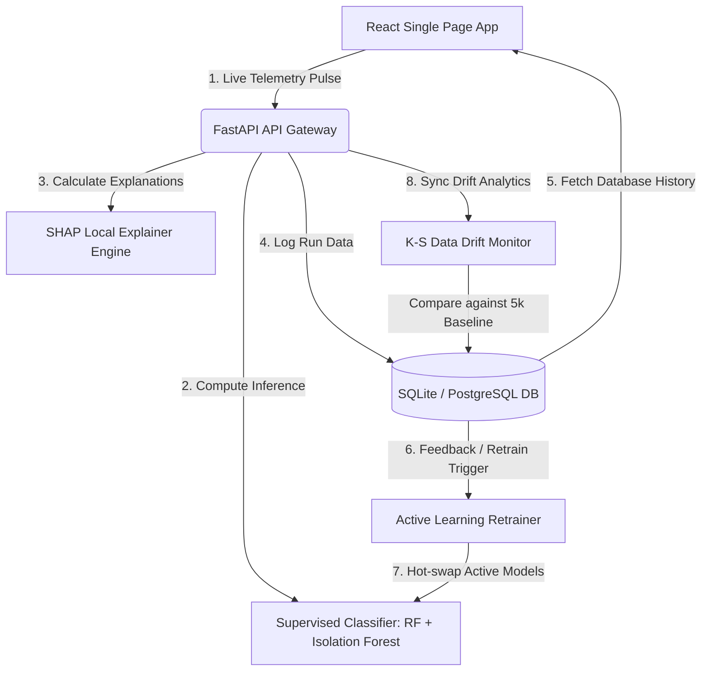

# AXON Predictive Engine 🚀
### Industrial IoT Telemetry, AI-Driven Anomaly Detection & Closed-Loop MLOps

AXON is a decoupled, full-stack AI application designed for real-time resource anomaly detection and predictive maintenance. Built with a high-fidelity **React (Vite) frontend** and a **FastAPI backend**, AXON tracks resource telemetry, computes explainable failure probability, and automatically monitors data drift and retraining pipelines.

---

## 🛠️ System Architecture

AXON features a modern decoupled architecture designed for high availability and low latency:



1. **Frontend**: Single Page Application built on **React (Vite)** with custom **Vanilla CSS Dark Glassmorphism**.
2. **Backend**: Lightweight **FastAPI** service serving low-latency RESTful predictions, explaining model decisions, and administering drift analytics.
3. **Database**: PostgreSQL (Supabase compatible) with automatic local fallback to SQLite. Uses SQLAlchemy for ORM.
4. **MLflow Tracking**: Integrated experiment logger to catalog training runs and model parameters.

---

## ✨ Core Capabilities & MLOps Pipeline

### 1. 8-Feature Telemetry Stream
The engine consumes a realistic, 8-dimensional operational telemetry map:
*   **CPU Usage (%)** & **RAM Usage (%)**
*   **Core Temperature (°C)** & **Network Latency (ms)**
*   **Disk I/O Saturation (%)** (tracks queue bottlenecks)
*   **Swap Space Usage (%)** (monitors page fault paging)
*   **Network Throughput (Mbps)** (tracks traffic density)
*   **Active Threads** (processing threads leak indicator)

### 2. Explainable AI (XAI) via SHAP Local Contributions
Every prediction pulse returns an additive contribution map. The engine calculates how much each of the 8 parameters pushed the risk score UP or DOWN relative to the training baseline:
$$\sum \text{local-contributions} = P_{\text{predicted}} - 0.10$$
Teal bars indicate stabilizing parameters keeping risk low, while red/orange bars reveal risk drivers pushing the system toward failure.

### 3. Kolmogorov-Smirnov (K-S) Data Drift Engine
Monitors silent model degradation by comparing the distribution of the last 30 live telemetry runs against a 5,000-row baseline distribution. If a metric's K-S test p-value falls below $0.05$, the system flags it as **DRIFTED** in the MLOps dashboard.

### 4. Closed-Loop Active Learning & Hot-Swapping
When operators log adjustments via the **Report False Positive** button, the backend registers the feedback. Once 5 new feedback logs accumulate, an asynchronous thread:
*   Extracts feedback and retraining data.
*   Refits the Random Forest classifier.
*   Hot-swaps the active model in memory with **zero downtime** for prediction requests.

---

## 📂 Project Structure

```
AXON-Predictive-Engine/
├── backend/                  # FastAPI Backend Server & ML Pipelines
│   ├── data/                 # SQLite database, baseline datasets, and synthetic logs
│   │   ├── generate_logs.py  # Script to generate baseline normal & failure datasets
│   │   └── system_logs.csv   # 5,000-row baseline reference dataset
│   ├── src/                  # Python Source Files
│   │   ├── app.py            # FastAPI Application Gateway (REST Endpoints)
│   │   ├── train.py          # Baseline model training script
│   │   └── retrain.py        # Active learning retraining script
│   └── models/               # Serialized classifier picklegroup files
│
├── frontend/                 # React SPA Dashboard (Vite)
│   ├── src/
│   │   ├── App.jsx           # Sidebar controller & active tab selector
│   │   ├── index.css         # Dark Glassmorphism typography & layout transitions
│   │   └── components/       # Tabs (MonitorTab, HistoryLogsTab, MLOpsTab, ValidationTab)
│   ├── package.json
│   └── vite.config.js
│
├── .github/workflows/        # CI/CD Workflows
└── README.md                 # Project Documentation
```

---

## 💻 How to Run Locally

### 1. Setup Backend
1. Navigate to the `backend/` directory:
   ```bash
   cd backend
   ```
2. Create and activate a Python virtual environment:
   ```bash
   python -m venv venv
   # On Windows (PowerShell):
   .\venv\Scripts\Activate.ps1
   # On Linux/macOS:
   source venv/bin/activate
   ```
3. Install dependencies:
   ```bash
   pip install -r requirements.txt
   ```
4. Generate the baseline dataset and train the initial models:
   ```bash
   python data/generate_logs.py
   python src/train.py
   ```
5. Launch the FastAPI backend:
   ```bash
   python -m uvicorn src.app:app --host 127.0.0.1 --port 10000
   ```

### 2. Setup Frontend
1. Open a new terminal and navigate to the `frontend/` directory:
   ```bash
   cd frontend
   ```
2. Install npm packages:
   ```bash
   npm install
   ```
3. Launch the Vite development server:
   ```bash
   npm run dev
   ```
4. Access the dashboard in your browser at [http://localhost:5173](http://localhost:5173).

---

## 🚀 System Validation Playbook
Recruiters and engineers can use the **04 / System Validation** tab to programmatically run QA test scenarios. Clicking a validation run will instantly load a pre-configured telemetry state (e.g. CPU Stress, Memory Saturation, Network Spike) and redirect you to the Monitor dashboard to audit the AI response, SHAP explanations, and drift logs in real time.